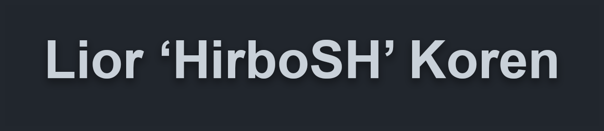

    

    
    

    <h2 style="text-align: center">👋 Welcome to my GitHub profile👋 <h2>
    

    <h3 style="text-align: center">ℹ️ A litte about me ℹ️</h3>
     
    <ul>
        <li>ℹ️ Nice to meet you, <b>my name is Lior.</b></li>
        <li>ℹ️ I currently live in <b>Israel.</b></li>
        <li>ℹ️ Next month I'll turn <b>16 y/o.</b></li>
        <li>ℹ️ Like to <b>program and exercise.</b></li>
        <li>ℹ️ Listening to <b>hardstyle music || EDM/hardstyle festivals.</b></li>
    </ul>
    

    <h3 style="text-align: center">⚙️ P.languages & tools I use ⚙️</h3>
     
    <ul>
        <li><b>⚙️ Website development -></b> [ Javascript, Typescript, PHP ]</li>
        <li><b>⚙️ Discord development -></b> [ Node.js (Using Discord.js) ]</li>
        <li><b>⚙️ Game servers development -></b> Counter Strike: Global offensive -> [ SourcePawn (Pawn) ] Grand Theft Auto V -> [ FiveM (Lua) ] Rust -> [ uMod (C#) ]</li>
        <li><b>⚙️ Game hacking -></b> [ Cheat Engine, ( Internal (C++) ) ]</li>
        <li><b>⚙️ Graphics -></b> [ Adobe Photoshop ]</li>
        <li><b>⚙️ Video -></b> [ Adobe Premire Pro ]</li>
        <li><b>⚙️ IDE -></b> [ Visual Studio / Visual Studio Code ]</li>
        <li><b>⚙️ Local server -></b> [ XAMPP (Containing MariaDB, PHP, etc.)
        ]</li>
        <li><b>⚙️ Linux (Penetration Testing) -></b> [ Kali Linux (2021.1) ]</li>
    </ul>
    

    <h3 style="text-align: center">📈 My GitHub stats 📈</h3>
     
    

        
        
    

